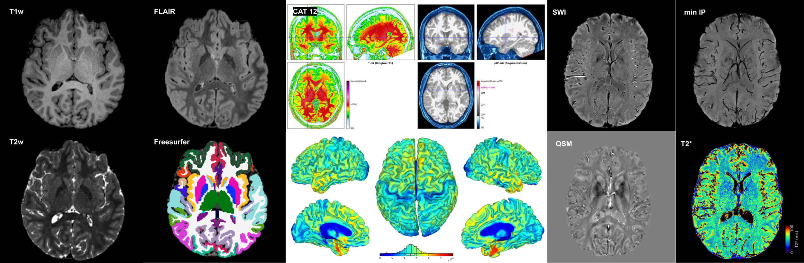

# BRAIN-TO MRI Protocols

A collection of optimised MRI scanning protocols for the Siemens MAGNETOM Prisma 3T (XA30 software), developed by the [BRAIN-TO Lab](https://uhndata.io/brain-to/) at the Krembil Brain Institute, University Health Network, Toronto.

> Refer to [Advancing Clinical and Neuroscientific Research Through Accessible and Optimized Protocol Design at 3T](https://marketing.webassets.siemens-healthineers.com/ed15b22a01ec5497/ef408bcafa80/siemens-healthineers-magnetom-world-Kashyap_Uludag_BRAIN-TO_protocols.pdf), Siemens MAGNETOM Flash (RSNA Edition, 2023) for a full overview.

---

## What is this?

This repository provides:
- **Protocol files** for download from Zenodo (`.exar1` for XA30, PDF parameter sheets for other software versions)
- **Processing pipelines** as Docker containers — no local installation needed
- **Helper scripts** for individual processing steps (fieldmap correction, distortion correction, registration)
- **Issue templates** so you can report problems or ask questions in a structured way

---

## Available Protocols

Download the protocol set that matches your imaging needs:

| Protocol Set | Modalities | Download |
|---|---|---|
| Complete Set | All below | [zenodo.org/records/10685481](https://zenodo.org/records/10685481) |
| Anatomy Set | T1w, T2w, FLAIR, MWF | [zenodo.org/records/10685475](https://zenodo.org/records/10685475) |
| fMRI Set | BOLD, ME-BOLD | [zenodo.org/records/10685458](https://zenodo.org/records/10685458) |
| Diffusion Set | DWI, DTI | [zenodo.org/records/10685449](https://zenodo.org/records/10685449) |
| ASL Set | pCASL | [zenodo.org/records/10685308](https://zenodo.org/records/10685308) |

Each Zenodo record contains the `.exar1` protocol file (import directly into XA30) and a PDF with full acquisition parameters for translation to other software versions.

See [PROTOCOLS.md](PROTOCOLS.md) for a detailed parameter summary table.

---

## Processing Pipelines (Containers)

> **Work in progress.** Containers are under active development.

Docker containers for the full processing pipelines will be hosted on DockerHub. See [containers/README.md](containers/README.md) for the pipeline index and usage instructions as they become available.

---

## Helper Scripts

> **Work in progress.** Scripts are under active development.

For running individual processing steps manually. Requires FSL and Python 3.8+.

See [scripts/README.md](scripts/README.md) for dependencies and usage.

| Script | What it does |
|---|---|
| `scripts/scanbids.py` | Summarise a BIDS dataset directory |
| `scripts/fieldmap/dualecho_fieldmap.sh` | Compute fieldmap from dual-echo GRE |
| `scripts/fieldmap/phasediff_fieldmap.sh` | Compute fieldmap from phase-difference image |
| `scripts/preprocessing/run_fsl_flirt.py` | Linear registration using FSL FLIRT |
| `scripts/preprocessing/run_fsl_topup.py` | Distortion correction using FSL TOPUP |

---

## Getting Help

Use GitHub Issues to report problems or ask questions. Choose the template that fits:

- **Protocol question** (parameter values, compatibility, operating mode) → [Open a protocol issue](../../issues/new?template=protocol.yml)
- **Scanner / acquisition problem** (error on scanner, unexpected images) → [Open an acquisition issue](../../issues/new?template=acquisition.yml)
- **Script or container bug** (code error, wrong output) → [Open a processing issue](../../issues/new?template=processing.yml)

For urgent requests: [sriranga.kashyap@uhn.ca](mailto:sriranga.kashyap@uhn.ca)

---

## Citation

If you use these protocols in your research, please cite:

> Kashyap S, Xi, Y, Uludağ K. *Advancing Clinical and Neuroscientific Research Through Accessible and Optimized Protocol Design at 3T.* Siemens MAGNETOM Flash, RSNA Edition, 2023.

Protocol files are archived on Zenodo — see individual DOIs in the table above.

---

## Contributing

Contributions are welcome. We are particularly interested in:

- **Specialised application protocols** — task-based fMRI, spectroscopy, quantitative MRI, or other sequences not covered here
- **Protocols from other vendors** — GE, Philips, Canon, or other MRI platforms
- **Processing scripts and pipelines** — tools that complement the existing workflows

If you have protocols or code you would like to share, please open an issue or get in touch directly. We are happy to collaborate.

For urgent or detailed discussions: [sriranga.kashyap@uhn.ca](mailto:sriranga.kashyap@uhn.ca)

---

## Contributors

- Sriranga Kashyap — BRAIN-TO Lab, Krembil Brain Institute, UHN
- Yuexin Xi — PhD Student, Dept. of Medical Biophysics, University of Toronto

## License

See [LICENSE](LICENSE).
